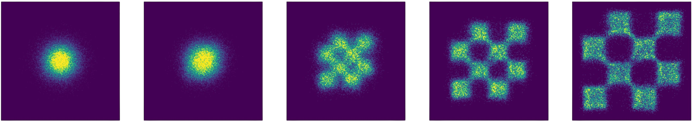

# Welcome!
This repository contains the labs for [*6.S184/6.S975: Generative AI with Stochastic Differential Equations*](https://diffusion.csail.mit.edu), as taught at MIT over IAP 2025. We will add in both labs and solutions as the class progresses. Changes made to the labs over the course of the class will be noted below. Questions, comments or concerns? Let us know [here](https://forms.gle/iixgq4E2wkwudEb19). Enjoy :)

### Changelog
- 1/22/25: Labs 1: Fix several typos in lab one.
- 1/27/25: Labs 1 + 2: Add clarification regarding truncated PDFs when submitting w/ Colab + Chrome.
- 1/27/25: Lab 2: Clarify numerical issues when sampling conditional SDE for large noise levels. Clarify differences between score parameterizations.

### Acknowledgements
We would like to thank the following individuals for their invaluable feedback and suggestions:
- Cameron Diao
- Tally Portnoi
- Andi Qu

